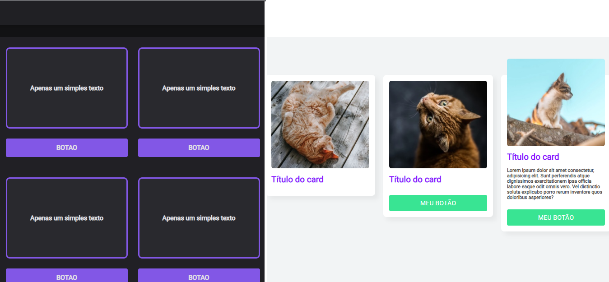

<h1 align="center">
  &nbsp;&nbsp;&nbsp;
  &nbsp;&nbsp;&nbsp;
  
</h1>

<h3 align="center">
  Front-End Design Essencial - HTML, CSS e JS Completo do Zero da Udemy
</h3>

Aprenda uma base sólida de HTML, CSS e JS criando um site do zero com foco nos elementos de interface e interações

Por Brunão Sousa

  <a href="#como-executar-o-projeto">Como executar o projeto</a>&nbsp;&nbsp;&nbsp;|&nbsp;&nbsp;&nbsp;
  <a href="#conteudo-do-curso">Conteúdo do curso</a>

 

  

## Como executar o projeto

- Execute `git clone https://github.com/eliasmcastro/udemy-front-end-design-essencial.git` para clonar este repositório
- Abra os arquivos HTML que estão dentro de cada pasta no seu navegador de preferência para ver o resultado

## Conteúdo do curso

- Introdução ao HTML e CSS
- Layouts, Grids e Flexbox
- Animações com CSS e SVG
- Javascript
- JQuery
- Projeto Final
- Publicando o Site
